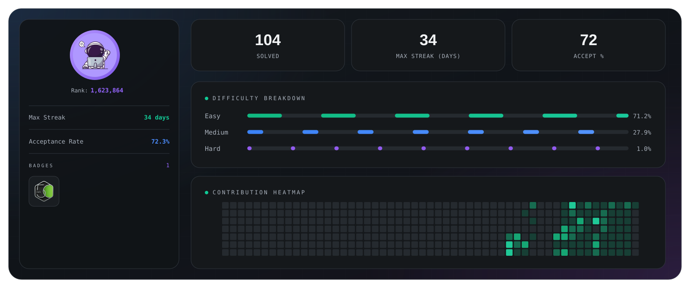
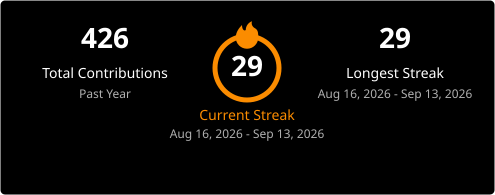

<h3 align="center">
Software Engineering • AI Engineering • Application Security
</h3>

  

---

## 💫 About Me

I'm a 3rd-year B.Tech student who enjoys building software and learning by creating real-world projects.

Currently, I'm focused on application development while exploring AI engineering, secure software development, and data structures & algorithms.

I enjoy understanding how systems work—from designing applications to learning how to make them more secure.

---

## 🚀 Current Projects

- **LeetCode Sync** — Syncs LeetCode submissions to GitHub automatically.
- **Multi-Threaded Port Scanner** — A concurrent TCP port scanner built in Python.
- **Educational Keystroke Logger** — A project to understand keyboard event handling and system interactions in a controlled environment.

---

## 🛠️ Tech Stack

### Languages

### Tools & Platforms

---

## 🎯 2026 Goals

- Build projects that solve real-world problems.
- Strengthen my foundation in AI engineering.
- Learn secure software development and application security.
- Make my first open-source contribution.
---

## 📊 LeetCode Stats

  

## 👾 Contribution Activity

  

## 📊 GitHub Stats

  
  

  

## 🌐 Connect With Me

  
  
  

## 💡 Philosophy

> I believe the best way to learn is by building.
>
> Every project teaches me something new about software engineering, AI, and security.

---

